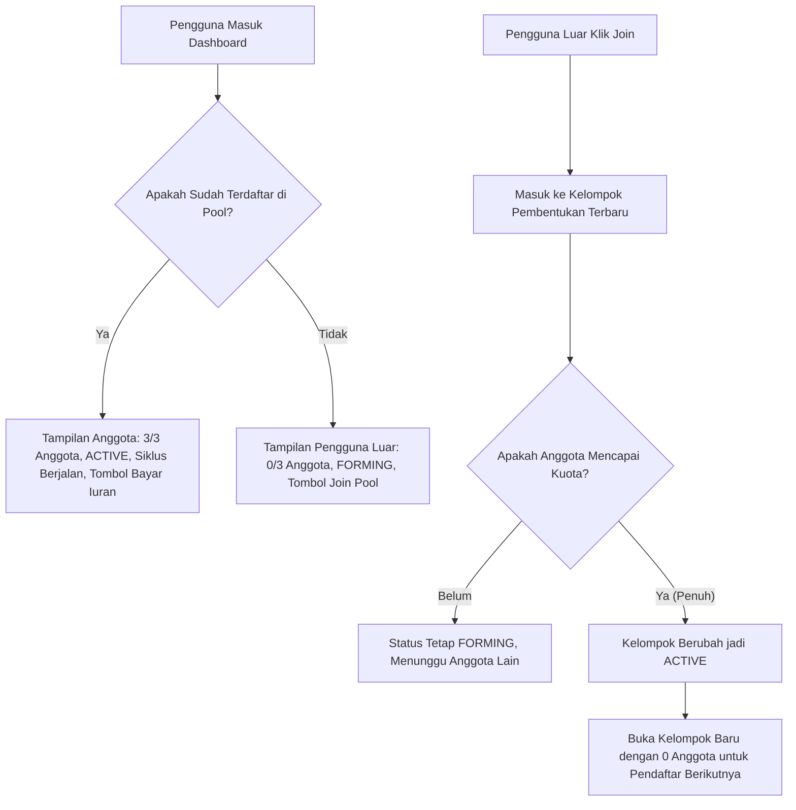

# 📘 WORKFLOW & SISTEM OPERASIONAL ARISAN MERIT CIRCLE

Dokumen ini menjelaskan alur kerja (*end-to-end workflow*) aplikasi Arisan On-Chain Merit Circle, mulai dari pendaftaran akun, pembentukan kelompok (*cohort*), pembayaran iuran, pengundian pemenang otomatis, hingga siklus arisan selesai.

---

## 🌟 1. Konsep Utama Sistem

Arisan Merit Circle adalah platform **ROSCA (*Rotating Savings and Credit Association*) terdesentralisasi** berbasis reputasi (*Merit Score*) dan lelang diskon (*Reverse Auction*):
- **Satu Dompet, Satu Kelompok (*Strict Lock-in*)**: Setiap dompet hanya boleh terikat pada satu arisan aktif dalam satu waktu hingga seluruh siklus selesai.
- **Iuran Bulanan**: Setiap siklus memiliki periode iuran (diatur 1 menit untuk pengujian lokal).
- **Penjamin Likuiditas**: Pemenang tiap siklus menerima total likuiditas kotor (*Prize Pool*) yang dikumpulkan dari seluruh anggota kelompok.
- **Pemenang Giliran Adil**: Setiap anggota dijamin menang tepat satu kali dalam satu putaran kelompok arisan.

---

## 👥 2. Arsitektur Multi-Kelompok (Cohort System)

Setiap pool (misalnya *Basic Pool*) dapat memiliki banyak kelompok yang berjalan secara simultan:

### A. Tampilan Anggota Terdaftar (*Enrolled Member*)
- **Kapasitas**: Menampilkan status kelompoknya sendiri (`3/3 Anggota`).
- **Status**: `🟢 Sedang Berjalan (Active)`.
- **Progres**: Menampilkan `Siklus X dari Y`.
- **Tombol Aksi**:
  - Jika belum bayar iuran siklus berjalan: Tombol hijau **Bayar Iuran (X MC)**.
  - Jika sudah bayar: Label hijau **Iuran Siklus X Lunas · Menunggu Undian**.

### B. Tampilan Calon Anggota (*Outsider*)
- **Kapasitas**: Menampilkan kelompok pembentukan terbuka yang sedang mencari anggota (`0 / 3 Anggota` atau `1 / 3 Anggota`).
- **Status**: `🟡 Menunggu Anggota`.
- **Indikator Global**: Menampilkan `X Kelompok Aktif` yang sedang berjalan di pool tersebut.
- **Tombol Aksi**: Tombol biru **Join Pool** atau **Approve MC Token**.

---

## 🚀 3. Alur Kerja Lengkap Pengguna (Step-by-Step)

### Tahap 1: Koneksi Wallet & Profil Pengguna
1. Pengguna membuka antarmuka web di `http://localhost:3000`.
2. Klik tombol **Connect Wallet** di pojok kanan atas menggunakan MetaMask atau wallet Web3 lainnya (jaringan Localhost 8545 / Chain ID 31337).
3. **Jika pengguna baru**: Klik **Daftar untuk Join**, isi username dan profil. Akun otomatis terdaftar di database.
4. **Jika menggunakan wallet uji (QA)**: Akun whitelist otomatis berstatus **Tier 5 (Merit Score 100)** dan terverifikasi penuh.

---

### Tahap 2: Bergabung ke Pool Arisan (Join Pool)
1. Pengguna memilih pool yang sesuai dengan tier reputasinya (misal: *Basic Pool* untuk Tier 0+).
2. Klik tombol **Join Pool**:
   - **Langkah Otomatis 1 (Approve Token)**: Frontend memeriksa izin penarikan token MC secara real-time di blockchain. Jika belum disetujui, MetaMask akan membuka jendela konfirmasi **Persetujuan Token (Approve)**.
   - **Langkah Otomatis 2 (Signature Gatekeeper)**: Setelah approval terkonfirmasi di on-chain, sistem meminta tanda tangan digital otorisasi dari backend (`/api/pools/signature`) yang memvalidasi tier dan reputasi pengguna.
   - **Langkah Otomatis 3 (On-Chain Join)**: MetaMask membuka jendela konfirmasi kedua secara otomatis untuk mengeksekusi **joinPool**:
     - Menarik setoran iuran siklus pertama (misal: 50 MC).
     - Menandai iuran siklus 1 lunas.
     - Mengunci dompet pengguna ke dalam kelompok tersebut.
3. Notifikasi sukses muncul dan status kartu berubah menjadi `Terdaftar (Menunggu Kuota Penuh)`.

---

### Tahap 3: Aktivasi Kelompok Otomatis (*Group Activation*)
1. Ketika kuota anggota kelompok terpenuhi (misal: pendaftar ke-3 masuk di *Basic Pool*):
   - Kontrak pintar secara otomatis mengubah status kelompok menjadi `ACTIVE`.
   - Waktu tenggat (*deadline*) siklus 1 dihitung: `block.timestamp + cycleDuration`.
   - Kontrak secara otomatis menaikkan indeks kelompok pembentukan (`currentCohort + 1`), sehingga pendaftar ke-4 dan seterusnya akan masuk ke kelompok baru dengan kapasitas `0 / 3`.

---

### Tahap 4: Pembayaran Iuran Siklus Berjalan (Siklus 2 dan Seterusnya)
1. Pada siklus ke-2 hingga siklus terakhir:
   - Anggota yang belum membayar akan melihat tombol hijau **💳 Bayar Iuran (X MC)**.
2. Pengguna mengklik tombol bayar:
   - Kontrak mengeksekusi `contribute(poolId)`.
   - Token MC ditransfer ke kontrak pool, dan metrik MC terkumpul bertambah di blockchain.
   - Status tombol berubah menjadi `✅ Iuran Siklus X Lunas · Menunggu Undian`.

---

### Tahap 5: Mode Lelang Diskon (*Khusus Tier 4 Elite & Tier 5 Prime*)
1. Pada pool berlabel mode auction (*Elite Pool* dan *Prime Pool*):
   - Setelah membayar iuran siklus berjalan, anggota yang belum pernah menang dapat memasang tawaran (*bid*) jumlah payout yang ingin mereka terima (diskon maksimal 15%).
   - Penawar dengan **bid terendah** yang sah akan ditetapkan sebagai pemenang siklus.
   - Selisih antara nominal pool dan bid pemenang (*Surplus*) didistribusikan:
     - 60% dibagi rata kepada seluruh anggota lain yang membayar tepat waktu (*Cashback Dividen*).
     - 25% disetor ke dana cadangan (*Reserve Fund*).
     - 15% disetor ke kas protokol (*Treasury*).

---

### Tahap 6: Pengundian Pemenang & Payout Otomatis (*Auto-Settlement Keeper*)
Platform dilengkapi dengan **Keeper Otomatis** di background:
1. **Pemicu Settlement**: Siklus siap ditutup jika:
   - Seluruh anggota kelompok telah membayar iuran siklus tersebut, ATAU
   - Batas waktu siklus (*deadline*) telah terlewati.
2. **Penetapan Pemenang (Merit Queue)**:
   - Pemenang dipilih berdasarkan ranking:
     $$\text{Merit Score tertinggi} \rightarrow \text{Waktu bergabung terlama (Tenure)} \rightarrow \text{Urutan dompet}$$
   - Anggota yang sudah pernah menang di putaran ini tidak akan diundi lagi.
3. **Eksekusi On-Chain & Transfer Hadiah**:
   - Backend Keeper mengeksekusi transaksi `settleCycle` on-chain.
   - Kontrak mentransfer total hadiah likuiditas (misal: 150 MC) **langsung ke dompet pemenang**.
   - Pemenang menerima **Push Notification browser** secara instan:
     > *"🏆 Selamat! Anda Memenangkan Arisan Basic Pool! Total hadiah 150 MC telah ditransfer langsung ke dompet Anda."*
4. Kelompok otomatis berpindah ke siklus berikutnya (`currentCycle + 1`).

---

### Tahap 7: Penyelesaian Arisan & Pelepasan Kunci (*Unlocked*)
1. Ketika siklus terakhir selesai (misal: siklus ke-3 pada pool dengan 3 anggota):
   - Seluruh anggota telah menerima giliran hadiah masing-masing 1 kali.
   - Status kelompok berubah menjadi `COMPLETED`.
   - **Seluruh anggota kelompok otomatis dibuka kuncinya (*unlocked*)** baik di kontrak pintar maupun di database.
2. Pengguna kini bebas untuk bergabung kembali ke kelompok baru yang sedang buka di pool mana pun sesuai tier mereka.

---

## 💡 5. Catatan Penting Transaksi On-Chain

- **Dua Langkah Transaksi Saat Pertama Kali Bergabung**:
  1. **Konfirmasi 1**: `approve` (memberikan izin kepada kontrak MeritPool untuk menarik MC token).
  2. **Konfirmasi 2**: `joinPool` (kontrak menarik iuran siklus pertama dan mendaftarkan dompet Anda).
  *Catatan: Sistem secara otomatis merangkai langkah ini. Jangan menutup browser di antara konfirmasi.*
- **Jika Transaksi Pernah Gagal (*Reverted*)**: Pastikan saldo MC mencukupi di dompet dan akun Anda telah terdaftar/terverifikasi.

---

## 🛠️ 6. Referensi Kontrak & Akun Pengujian Lokal

### Alamat Kontrak Terdeploy di Anvil (Chain ID 31337):
- **MC Token**: `0x5FbDB2315678afecb367f032d93F642f64180aa3`
- **TokenSwap**: `0xe7f1725E7734CE288F8367e1Bb143E90bb3F0512`
- **MeritPool (Multi-Cohort)**: `0xCf7Ed3AccA5a467e9e704C703E8D87F634fB0Fc9`

### Akun Uji yang Sudah Didanai (1.000 ETH + 50.000 MC):
1. `0x59250f719772EE841a1a5eC6AC4B1e32ec3F1d7F` (Tier 5 / Merit Score 100)
2. `0xB4a86B0C67b9676F7805720d0F2b12B12F598cbF` (Tier 5 / Merit Score 100)
3. `0xad4190970D0247F67A97186789f4D7c7dB3785B1` (Tier 2 / Merit Score 45)
4. `0x26dc1a85f5f2C58Ec434b741aE3d9CA891D25806` (Tier 5 / Merit Score 100)
