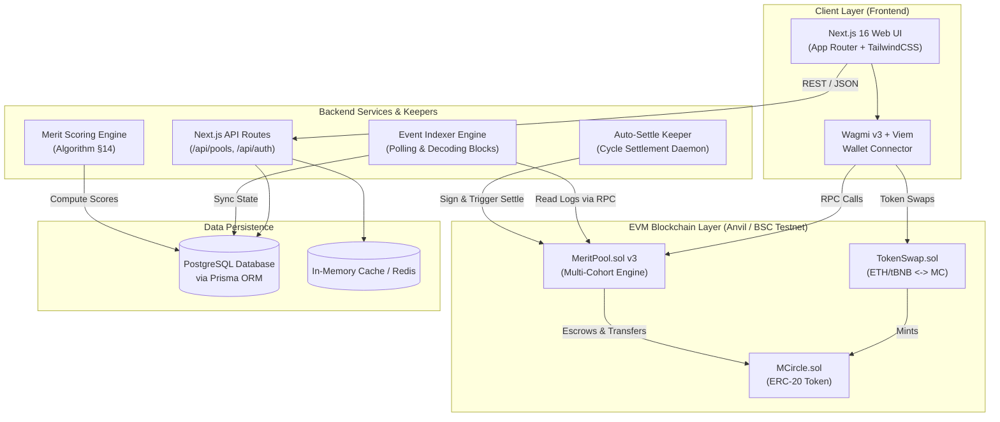
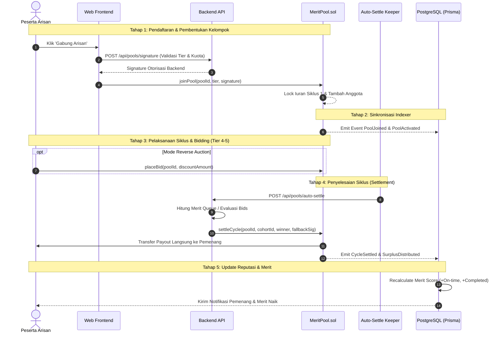
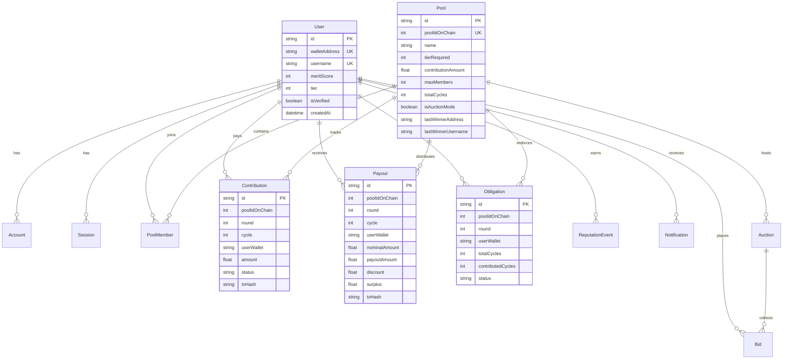

# Arsitektur Sistem & Design Decisions (ADR) — Merit Circle 📐

Dokumen ini menjelaskan arsitektur teknis, diagram aliran data, skema database, keputusan desain arsitektur (ADR), pertimbangan keamanan, dan peta skalabilitas untuk platform **Merit Circle**.

---

## 🏛️ 1. High-Level Architecture Diagram

---

## 🔄 2. Data Flow Diagram (Siklus Hidup Arisan)

---

## 🗄️ 3. Database Schema (Entity Relationship Diagram)

---

## 📑 4. Architectural Decision Records (ADR)

### ADR-001: Arsitektur Multi-Cohort pada Smart Contract MeritPool
* **Status**: Diterima & Diimplementasikan (v3)
* **Konteks**: Pada versi v1 arisan, satu pool (misal Basic Pool) hanya menampung 1 kelompok yang berjalan sekuensial. Jika kelompok sedang berjalan, calon peserta lain harus menunggu seluruh siklus tuntas (terblokir).
* **Keputusan**: Mengadopsi model **Multi-Cohort** (`cohortId`). Satu jenis konfigurasi pool dapat memiliki banyak kelompok aktif secara paralel. Kelompok baru langsung terbentuk secara otomatis begitu kapasitas kelompok sebelumnya terpenuhi.
* **Konsekuensi**: 
  - *Positif*: Utilisasi modal maksimal, tidak ada waktu tunggu bagi anggota baru.
  - *Mitigasi*: Parameter fungsi view dan event harus selalu menyertakan pasangan `(poolId, cohortId)`.

---

### ADR-002: Reverse Auction dengan Surplus Splitting untuk Tier Tinggi
* **Status**: Diterima & Diimplementasikan
* **Konteks**: Peserta Tier 4 (Elite) dan Tier 5 (Prime) memiliki kebutuhan likuiditas mendesak yang berbeda-beda. Mekanisme undian murni tidak memberikan insentif bagi peserta yang bersedia menerima payout lebih awal dengan diskon.
* **Keputusan**: Menerapkan lelang terbalik (*reverse auction*). Penawar diskon terendah yang valid berhak memenangkan payout siklus berjalan. Sisa dana iuran (*surplus*) dibagi secara adil: 60% dikembalikan ke seluruh anggota kelompok yang patuh, 25% masuk ke Reserve Pool (dana darurat), dan 15% dialokasikan ke DAO Treasury.
* **Konsekuensi**: Tercipta efisiensi pasar likuiditas internal tanpa risiko pinjaman macet (uncollateralized lending).

---

### ADR-003: Hybrid On-Chain Escrow & Off-Chain Scoring Engine
* **Status**: Diterima & Diimplementasikan
* **Konteks**: Penghitungan Merit Score (§14) melibatkan analisis historis multivariabel (kehadiran tepat waktu, rasio penyelesaian kewajiban, konsistensi bulanan, dan tenure). Menghitung seluruh matriks ini on-chain akan menghabiskan biaya gas astronomis.
* **Keputusan**: Dana dan penyelesaian siklus dijamin 100% oleh smart contract on-chain (non-custodial escrow). Komputasi skor reputasi dilakukan off-chain oleh backend engine yang menandatangani otorisasi hasil via kriptografi ECDSA (`keccak256` + EIP-191). Kontrak memvalidasi signature backend sebelum mengeksekusi penarikan atau penetapan pemenang.
* **Konsekuensi**: Efisiensi gas maksimal dengan tingkat integritas kriptografis yang setara dengan validasi on-chain.

---

## 🛡️ 5. Pertimbangan Keamanan (Security Considerations)

1. **Non-Reentrant & Checks-Effects-Interactions**: Seluruh fungsi transfer dana on-chain di `MeritPool.sol` dan `TokenSwap.sol` menggunakan modifier `nonReentrant` OpenZeppelin serta memastikan pembaruan state internal mendahului transfer token.
2. **Anti-Frontrunning pada Auction**: Penawaran bid lelang bersifat *strictly monotonically decreasing* (`amount < existingBid`). Batas bawah diskon dikunci secara matematis maksimal 15% (`MAX_DISCOUNT_BPS_CAP`).
3. **Sybil Resistance via Merit Score & Tier Lock**: Pengguna hanya dapat bergabung ke pool yang sesuai dengan tier reputasinya. Akun baru dengan Merit Score 0 terkunci di Tier 0 (Basic Pool) dan tidak dapat mengakses pool bernominal besar.
4. **Resistensi terhadap Serangan Replay**: Setiap signature pendaftaran dan penetapan pemenang mengikat alamat wallet, poolId, round/cohortId, dan nonce unik yang langsung hangus setelah 1 kali pemakaian.

---

## 📈 6. Rencana Skalabilitas (Scalability Plan)

1. **Layer 2 Migration (OpBNB / Arbitrum)**: Format smart contract berbasis EVM murni dan siap di-deploy langsung ke jaringan L2 berbiaya gas mendekati nol untuk mengakomodasi frekuensi transaksi mikro harian.
2. **Event Streaming dengan WebSockets**: Transisi dari mekanisme polling indexer ke arsitektur event-driven berbasis WebSocket subscriptions (EVM log filters) guna menghasilkan update UI berkecepatan sub-detik.
3. **Decentralized Keeper Network (Chainlink Automation / Gelato)**: Menggantikan cron job backend internal dengan jaringan decentralized keeper untuk memicu `settleCycle` secara otomatis tanpa titik kegagalan tunggal (*single point of failure*).
